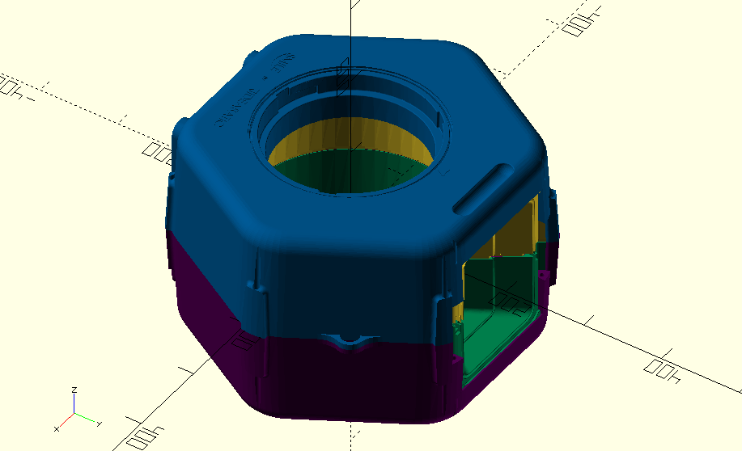

## Tasks completed
- Learned basic skills in OpenSCAD and exporting .STL files.

- Preliminary design of electronics module casing on OpenSCAD ready for future compatibility adjustments.

- Preparing for 3D printing of casing.
- Transfer of SMILE design files into OpenSCAD (shell and door).

## Personal and technical developments
Understanding OpenSCAD syntax:
- Simple but required time to get used to and not as intuitive as Solidworks.
- Using difference/intersection commands to edit .STL imported files becomes rather buggy.

Assembling components:
- 
